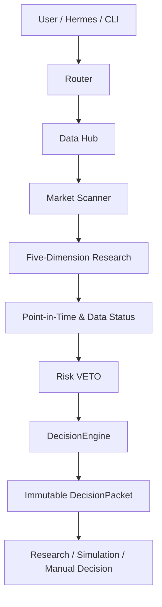
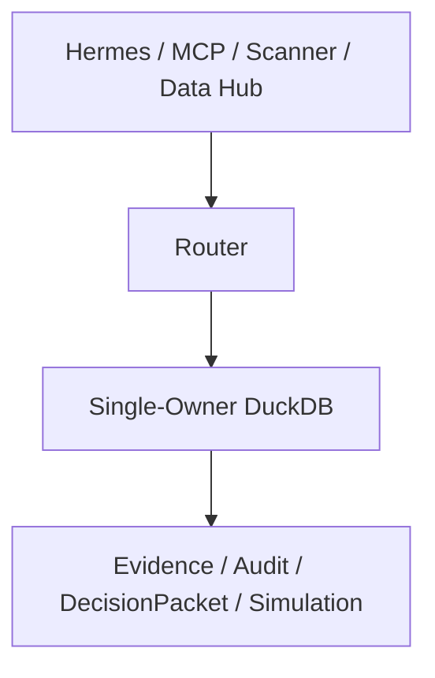

<div align="center">

[简体中文](README.md) | English

# AIQUANT-LITE

### A local-first AI + Quant research and decision-support framework for China's A-share market

From market-wide screening to auditable decisions—structured as a local, explainable, and testable research workflow.

[](https://www.python.org/)
[](https://fastapi.tiangolo.com/)
[](https://duckdb.org/)
[](#quality-and-testing)
[](LICENSE)

**Built for research and decision support—not automated live trading.**

</div>

## What is AIQUANT-LITE?

**AIQUANT-LITE is a local AI + Quant research, screening, risk-control, and decision-support system for China's A-share market.**

It combines structured market data, deterministic policy, and specialized model roles in one auditable pipeline. Facts are collected before models reason; data timing and risk constraints are checked before a decision packet is produced.

> This is not an automated live-trading system. It does not connect to a broker or submit live orders. It makes no return claims and is not investment advice.

## Highlights

| Capability | Current implementation |
|---|---|
| Market-wide screening | Deterministic local filters, ranking, and result cards; the scanner makes no model calls and emits no trade orders |
| Five-dimension research | Technical, fundamental, sentiment, policy/news, and capital flow; formal scoring remains 60% technical + 40% fundamental |
| Risk-first decisions | Point-in-Time checks, data status, position state, and hard Risk VETO take precedence over positive scores |
| Auditable output | `DecisionEngine` resolves actions, sizing, and price zones; immutable `DecisionPacket` records are versioned and SHA-256 verified |
| Multiple data sources | Tushare Pro, AKShare, BaoStock, CNInfo, and source-attributed verification paths |
| Specialized model roles | LongCat, Qwen, DeepSeek, and MiMo can be routed to synthesis, announcement verification, risk review, and vision roles |
| Strategy research | Shadow factors, A/B replay, Walk-Forward evaluation, parameter sensitivity, and market-regime attribution |
| Local simulation | Paper accounts, portfolio research, a separate user-reported trade ledger, and read-only review workflows |
| User isolation | `local_user_id` is the business-data isolation key; external channels map to local identities |
| Safe database topology | Router is the sole online owner of the primary DuckDB; other components access it through Router |
| Multiple entry points | CLI, FastAPI, Finance Data MCP, and Hermes; WeCom support is currently local rendering/simulation and configuration health checks |

### Formal score and shadow research

The production decision score is intentionally narrow:

```text
Formal Score = Technical 60% + Fundamental 40%
```

Sentiment, policy/news, capital flow, and the five-factor composite remain shadow or enhancement inputs with formal weight `0`. They can be observed, replayed, and compared without silently changing the formal strategy.

## Workflow



Deterministic safeguards run before model output is accepted. Failed, stale, or temporally invalid data causes a downgrade, wait state, or VETO; models are not allowed to fabricate missing facts.

## Database topology



In normal online operation, Router is the only process allowed to open the primary database directly. Non-owner connections are rejected. Offline maintenance requires Router to be stopped first; the runtime does not use the legacy “kill a process after a database lock” pattern.

## Repository map

```text
aiquant-lite/
├─ data_hub/              # Quotes, fundamentals, filings, news, history, market-wide data
├─ router/                # Agent routing, risk budgets, audits, and unified APIs
├─ trading/
│  ├─ scanner/            # Market screening and candidate ranking
│  ├─ research/           # Five dimensions, PIT, shadow factors, and experiments
│  ├─ decision_support/   # DecisionEngine, VETO, DecisionPacket, sizing, and plans
│  ├─ simulation/         # Local paper accounts and portfolio research
│  └─ review/             # Read-only review workflows
├─ manual_tracking/       # Facts about trades or positions entered by the user elsewhere
├─ mcp_servers/           # Finance Data MCP
├─ database/migrations/   # Database migrations
├─ desktop/               # Local desktop workspace
├─ scripts/               # Operations, backfills, diagnostics, and validation
└─ tests/                 # Unit, integration, boundary, and migration tests
```

## Stack

| Layer | Technology |
|---|---|
| Runtime | Python 3.11, asyncio |
| API / protocol | FastAPI, Pydantic, MCP |
| Storage | DuckDB with a single-owner Router topology |
| Data | Tushare, AKShare, BaoStock, CNInfo, pandas |
| Model routing | LongCat, Qwen, DeepSeek, MiMo (optional and configuration-driven) |
| Desktop / delivery | PySide6, PyInstaller, Inno Setup |
| Quality | pytest, Ruff, deterministic safety checks |

## Quick start

Python `3.11` and [uv](https://docs.astral.sh/uv/) are required.

```powershell
git clone https://github.com/Shixi216/aiquant-lite.git
cd aiquant-lite
uv sync --dev
Copy-Item .env.example .env
```

Add only the credentials you intend to use to the local `.env`. Missing provider credentials disable the corresponding roles or trigger a safe fallback.

Run the preflight and live-execution boundary checks:

```powershell
uv run python -m scripts.preflight_check
uv run python -m scripts.check_no_live_execution
```

Start the managed Windows services:

```powershell
powershell -ExecutionPolicy Bypass -File scripts\start_hermes_opc.ps1
powershell -ExecutionPolicy Bypass -File scripts\status_hermes_opc.ps1
```

Or run each local service directly:

```powershell
uv run python -m scripts.run_router_api
uv run python -m scripts.run_data_api
uv run python -m mcp_servers.finance_data.server
```

Useful research entry points:

```powershell
uv run python -m scripts.scanner_cli --help
uv run python -m scripts.stock_report --help
uv run python -m scripts.experiment_cli --help
uv run python -m scripts.history_cli --help
```

The default endpoints are intended for local use. Do not expose them publicly without authentication and network controls.

## Screenshots and demos

The public repository intentionally contains no screenshots of real holdings, trades, conversations, or personal settings. The README uses Mermaid diagrams instead. Future demos should use synthetic data only.

## Quality and testing

The current worktree passes **1,285 tests** across:

- Router-owned DuckDB topology and concurrency boundaries;
- broker-free dependencies, APIs, and decision-to-order paths;
- Point-in-Time constraints, formal 60/40 scoring, VETO, and action consistency;
- immutable DecisionPacket records, hashes, and version chains;
- market-wide screening, historical data, shadow/A-B replay, Walk-Forward, and sensitivity analysis;
- user isolation, paper trading, manual fact ledgers, and read-only reviews;
- Windows desktop delivery and Hermes integration.

```powershell
uv run pytest
uv run ruff check .
```

Passing tests do not prove that a strategy will remain profitable. Backtests and experiments are evidence about past behavior, not guarantees about future markets.

## Security

- `.env`, credentials, DuckDB files, logs, reports, backups, caches, and runtime state stay out of Git.
- `.env.example` contains variable names, empty values, and safe example defaults only.
- Router is the sole online owner of the primary DuckDB.
- Provider output is treated as untrusted input, and error output is sanitized.
- Never paste real credentials or user data into issues, pull requests, logs, or screenshots.

Please follow [SECURITY.md](SECURITY.md) for private vulnerability reporting.

## Documentation

- [Architecture](docs/architecture.md)
- [API reference](docs/api-reference.md)
- [Data pipeline](docs/data-pipeline.md)
- [Scanner](docs/scanner.md)
- [Operations](docs/operations.md)
- [Security](docs/security.md)
- [Known limitations](docs/limitations.md)
- [Hermes integration](docs/hermes-integration.md)

## Roadmap

- expand formal Point-in-Time fundamental coverage and continuous quality metrics;
- complete the human approval queue and audit UI;
- collect longer Walk-Forward and shadow evidence across market regimes;
- add model-cost, reliability, and data-coverage dashboards;
- enable multimodal roles only after audited input contracts are complete;
- publish a synthetic-data demo.

## Disclaimer

AIQUANT-LITE is intended for research, education, backtesting, simulation, and manual decision support. Scores, candidates, risk flags, sizing suggestions, and price zones are not securities advice. Users remain responsible for their own decisions and risk.

## License

[MIT](LICENSE)
