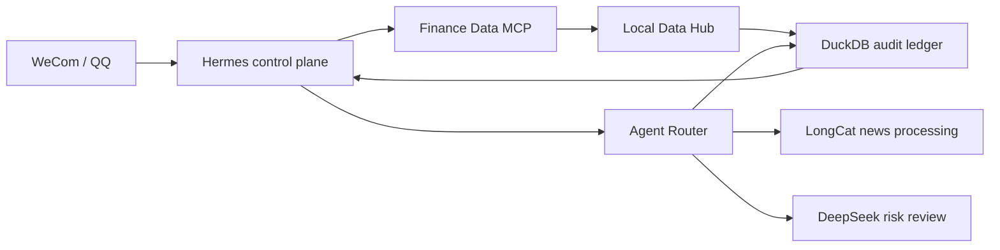

# aiquant-lite

[简体中文](README.zh-CN.md) | English

`aiquant-lite` is a local-first, evidence-aware A-share research workspace. It separates
structured market data from model reasoning so that an LLM never needs to invent prices,
financial figures, or announcement metadata.

> Status: runnable local research MVP; approximately 75% of the original plan is complete.
> Research and simulated-analysis use only. It does not place orders and is not investment advice.

## Is the project complete?

The core MVP is complete, but the full project plan is not:

- real data, the six-tool MCP, Hermes/WeCom entry, model routing, risk budgets, and the main audit
  path work locally;
- LongCat news processing and DeepSeek high-risk review have completed real provider calls;
- 30-day reliability evidence, human approval workflows, cost metrics, complete multimodal roles,
  and a separate report agent remain unfinished;
- there is no broker order execution capability.

See [docs/project-status.md](docs/project-status.md) and the detailed
[Chinese status report](docs/project-status.zh-CN.md).

## Runtime in plain language



Hermes receives and schedules work. The Data Hub supplies attributed facts. The Router chooses a
specialist under risk and budget limits. DeepSeek reviews high-risk output. DuckDB records the
evidence and calls before Hermes returns the result.

## Architecture

```text
Hermes / another MCP client
          |
          v
Finance Data MCP  ---->  Agent Router
          |                 |-- LongCat: news processing
          |                 `-- Qwen: announcement verification
          v
Local Data Hub
  |-- Tushare Pro
  |-- AKShare / public exchange sources
  `-- BaoStock
          |
          v
DuckDB audit and evidence store
```

The repository currently contains:

- a FastAPI data service for stock basics, daily bars, quotes, financial statements,
  announcements, and finance news;
- cross-source daily-bar verification and source-attributed records;
- a specialist model router with audited LongCat and Qwen pipelines;
- a Finance Data MCP server exposing exactly six approved read-only research tools;
- deterministic market-fact verification against persisted evidence;
- a dry-run-first Hermes installer with backups, an MCP allowlist, and WeCom cron migration.
- deterministic risk-level and model-call-budget controls with auditable decisions.
- configurable DeepSeek and MiMo providers, with safe high-risk review fallback behavior.

## Finance Data MCP tools

| Tool | Purpose |
|---|---|
| `get_realtime_quote` | Return a realtime quote or a verified latest-close fallback |
| `get_daily_bars` | Fetch and cross-check daily bars from structured providers |
| `get_financial_statement` | Return the three major statements for a reporting period |
| `list_announcements` | List source-attributed CNInfo announcements |
| `search_finance_news` | Search media reports while preserving unverified status |
| `verify_market_fact` | Compare a claimed value with persisted, attributed evidence |

## Quick start

Requirements: Python 3.11 and [uv](https://docs.astral.sh/uv/).

```powershell
git clone https://github.com/Shixi216/aiquant-lite.git
cd aiquant-lite
uv sync --dev
Copy-Item .env.example .env
```

Add only the provider credentials you intend to use to `.env`. Never commit that file.

Run the REST services:

```powershell
uv run python scripts/run_data_api.py
uv run python scripts/run_router_api.py
```

Run the MCP server over stdio (the default and recommended local Hermes transport):

```powershell
uv run python -m mcp_servers.finance_data.server
```

Connect an existing Hermes 0.18 installation after previewing the changes:

```powershell
$env:HERMES_HOME = "E:\hermes"
uv run python scripts/configure_hermes_integration.py
uv run python scripts/configure_hermes_integration.py --apply
```

See [docs/hermes-integration.md](docs/hermes-integration.md) for backup, verification, and
delivery details. Local Hermes configuration and credentials remain outside this repository.

For local Streamable HTTP instead:

```powershell
$env:OPC_MCP_TRANSPORT = "streamable-http"
uv run python -m mcp_servers.finance_data.server
```

The endpoint is then `http://127.0.0.1:8767/mcp`. Do not bind it to a public interface without
adding authentication and network controls.

## Verification policy

`verify_market_fact` never calls an LLM. A structured fact is verified only when at least two
independent stored sources agree within the configured tolerance. A single verified official
announcement is sufficient for facts directly contained in that announcement. Conflicts and
missing evidence are returned explicitly instead of being silently resolved.

## Risk and budget routing

Generic Router requests accept `risk_level` (`low`, `medium`, `high`, or `critical`) and
`budget_tier` (`economy`, `standard`, or `premium`). The policy is deterministic and runs before
any provider call:

- budget tiers cap output tokens per call and the total number of physical model calls;
- risk levels cap sampling temperature;
- high and critical results are marked as requiring human review and request escalation to the
  `risk_controller` role when that role becomes available;
- incompatible combinations, such as critical risk with a standard budget, are rejected before
  credentials or provider capacity are consumed.

The applied decision is returned in `RouterInvokeResponse.routing` and persisted with the audit
result. Inspect the public policy matrix at `GET /v1/routing/policy`.

For `high` and `critical` requests, the Router also attempts an automated `risk_controller`
review inside the same task and physical-call budget when DeepSeek is configured. The result is
returned as `risk_review.status`:

- `completed`: a validated structured review is available;
- `unavailable`: the risk provider is not configured;
- `failed`: the provider call or structured-output validation failed;
- `budget_exhausted`: the request used all permitted physical calls.

All four cases retain the human-review requirement. Automated review is defense in depth, not a
replacement for approval.

## Specialist providers

DeepSeek uses its official OpenAI-compatible endpoint and defaults to `deepseek-v4-pro`:

```dotenv
DEEPSEEK_API_KEY=
OPC_DEEPSEEK_BASE_URL=https://api.deepseek.com
OPC_DEEPSEEK_MODEL=deepseek-v4-pro
```

MiMo is registered as an OpenAI-compatible provider, but its endpoint must be configured
explicitly so the project never silently routes private data through an assumed third party:

```dotenv
XIAOMI_API_KEY=
OPC_MIMO_BASE_URL=
OPC_MIMO_MODEL=mimo-v2.5
```

The MiMo adapter is ready for provider-level integration. Vision roles remain disabled until the
Router request contract supports audited image inputs.

### Local private configuration

If Hermes already contains the provider credentials, preview and apply the allowlisted sync:

```powershell
uv run python -m scripts.sync_local_provider_env --source E:\hermes\.env
uv run python -m scripts.sync_local_provider_env --source E:\hermes\.env --apply
```

Only currently used data, search, and model settings are copied. QQ, WeCom, TokenHub, and other
messaging credentials remain in the Hermes home. Values are never printed, and the previous
project `.env` is backed up under the ignored `backups/local-env/` directory.

Discover current model IDs without inference, then make minimal live calls when intended:

```powershell
uv run python -m scripts.check_live_specialist_providers
uv run python -m scripts.check_live_specialist_providers --invoke  # may incur API charges
uv run python -m scripts.check_live_risk_escalation                # writes an audit task
```

Never paste real credentials into source files, commits, issues, pull requests, or diagnostic
logs. Rotate any credential that has been disclosed outside its intended secret store.

## Live-trading boundary

This repository does not submit broker orders. Research output must not be wired directly to a
real-money account. Before any future live-trading adapter is enabled, every gate in
[docs/live-trading-readiness.md](docs/live-trading-readiness.md) must be implemented and tested,
including paper trading, order limits, idempotency, a kill switch, reconciliation, human approval,
and incident rollback.

## Security and privacy

- `.env`, credential backups, databases, runtime logs, downloaded documents, and caches are
  excluded from Git.
- `.env.example` contains names only and no usable credentials.
- MCP defaults to local-only binding and exposes a small allowlist of read-only tools.
- Provider output is treated as untrusted data; media reports are not promoted to facts.
- Before every public release, run the tests and scan the staged diff for secrets.

If you discover a security issue, follow [SECURITY.md](SECURITY.md) instead of opening a public
issue containing sensitive details.

## Development

```powershell
uv run pytest
uv run ruff check .
```

See [CONTRIBUTING.md](CONTRIBUTING.md) for contribution expectations.

## Roadmap

- validate the daily report for one full week and collect 30 trading days of metrics;
- add human-review APIs and an approval interface for `human_reviews`;
- calculate provider cost and aggregate reliability metrics;
- add audited multimodal request payloads and activate MiMo vision roles;
- connect human-review requirements to an explicit approval queue;
- implement the paper-trading and broker-safety gates before any order adapter;
- validate the migrated scheduled report across a full trading week;
- collect 30-day reliability, latency, cost, coverage, and human-review metrics.

## License

MIT. See [LICENSE](LICENSE).
