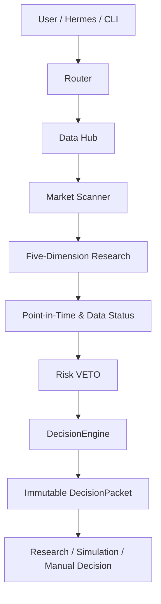
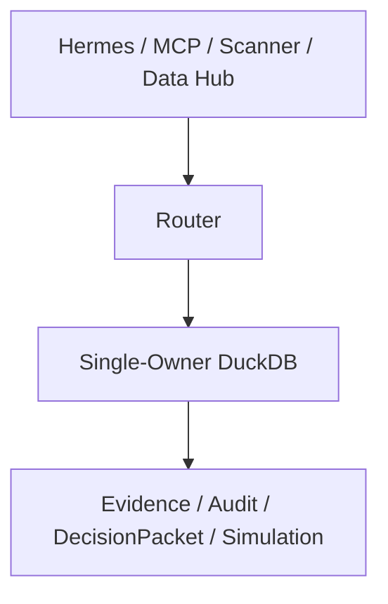

<div align="center">

[English](README.en.md) | 简体中文

# AIQUANT-LITE

### 本地优先的 A 股 AI + Quant 投研与决策支持框架

从全市场扫描到可审计决策，把 A 股投研流程做成一套本地、可解释、可验证的系统。

[](https://www.python.org/)
[](https://fastapi.tiangolo.com/)
[](https://duckdb.org/)
[](#测试与质量边界)
[](LICENSE)

**研究与决策支持，不是自动实盘交易。**

</div>

## 项目定位

**AIQUANT-LITE 是面向 A 股市场的本地化 AI + Quant 投研、扫描、风险控制和决策支持系统。**

它将结构化市场数据、确定性规则和多模型 Agent 分工组合在一条可审计链路中：先找事实，再做研究；先检查数据时点与风险，再生成决策包。

> 本项目不是自动实盘交易系统，不提供券商自动下单，不承诺收益，也不构成投资建议。

## 为什么是 AIQUANT-LITE

| 能力 | 当前实现 |
|---|---|
| 全市场扫描 | 本地确定性筛选、排序与结果卡；扫描阶段不调用模型、不生成交易指令 |
| 五维研究 | 技术面、基本面、情绪、政策/新闻、资金面；正式评分保持技术面 60% + 基本面 40% |
| 风险优先 | Point-in-Time、数据状态、持仓状态和硬风险 VETO 优先于正向评分 |
| 可审计决策 | `DecisionEngine` 生成动作、仓位和价格区间；`DecisionPacket` 冻结、版本化并以 SHA-256 校验 |
| 多源数据 | Tushare Pro、AKShare、BaoStock、CNInfo 等结构化来源，保留来源与校验状态 |
| 多模型协作 | LongCat、Qwen、DeepSeek、MiMo 按研究综合、公告核验、风险复核和视觉角色路由 |
| 策略研究 | Shadow、A/B 回放、Walk-Forward、参数敏感性与市场环境归因 |
| 本地模拟 | Paper Trading、模拟账户、手工成交事实账本与只读复盘；与真实券商账户隔离 |
| 多用户隔离 | 以 `local_user_id` 作为业务数据隔离主键，外部渠道映射到本地用户 |
| 数据库拓扑 | Router 是正常在线状态下主 DuckDB 的唯一 Owner，其他组件通过 Router 访问 |
| 多入口 | CLI、FastAPI、Finance Data MCP、Hermes；企业微信能力为本地渲染/模拟与配置检查 |

### 正式分与增强层

正式决策权重固定为：

```text
Formal Score = Technical 60% + Fundamental 40%
```

情绪、政策/新闻、资金面和五因子综合目前属于 Shadow/增强研究层，正式权重为 `0`。这让实验输入可以被观察和回放，而不会静默改变正式策略。

## 系统工作流



确定性边界先于模型输出：数据失败、过期、时点不合法或硬风险触发时，系统会降级、等待或 VETO，而不是用模型补齐事实。

## 数据库架构



正常在线状态下，Router 是主库唯一直接访问者。非 Owner 在线进程会被连接守卫拒绝；离线维护需要先停止 Router。项目不采用“数据库锁后杀进程重试”的旧方案。

## 模块结构

```text
aiquant-lite/
├─ data_hub/              # 行情、财务、公告、新闻、历史数据与全市场数据层
├─ router/                # Agent 路由、风险预算、审计与统一 API
├─ trading/
│  ├─ scanner/            # 全市场扫描与候选排序
│  ├─ research/           # 五维研究、PIT、Shadow 与实验
│  ├─ decision_support/   # DecisionEngine、VETO、DecisionPacket、仓位与计划
│  ├─ simulation/         # 本地模拟账户和组合研究
│  └─ review/             # 只读复盘
├─ manual_tracking/       # 用户已在外部完成的成交/持仓事实
├─ mcp_servers/           # Finance Data MCP
├─ database/migrations/   # 数据库迁移代码
├─ desktop/               # 本地桌面工作区
├─ scripts/               # 运维、回填、诊断和验证入口
└─ tests/                 # 单元、集成、边界与迁移测试
```

## 技术栈

| 层 | 技术 |
|---|---|
| Runtime | Python 3.11, asyncio |
| API / Protocol | FastAPI, Pydantic, MCP |
| Storage | DuckDB, Single-Owner Router topology |
| Data | Tushare, AKShare, BaoStock, CNInfo, pandas |
| Agent routing | LongCat, Qwen, DeepSeek, MiMo（按需配置） |
| Desktop / Delivery | PySide6, PyInstaller, Inno Setup |
| Quality | pytest, Ruff, deterministic safety checks |

## Quick Start

### 1. 安装

需要 Python `3.11` 与 [uv](https://docs.astral.sh/uv/)。

```powershell
git clone https://github.com/Shixi216/aiquant-lite.git
cd aiquant-lite
uv sync --dev
Copy-Item .env.example .env
```

只在本地 `.env` 中填写实际使用的凭证。未配置的模型角色会保持禁用或安全降级。

### 2. 启动前检查

```powershell
uv run python -m scripts.preflight_check
uv run python -m scripts.check_no_live_execution
```

### 3. 启动本地服务

```powershell
powershell -ExecutionPolicy Bypass -File scripts\start_hermes_opc.ps1
powershell -ExecutionPolicy Bypass -File scripts\status_hermes_opc.ps1
```

也可以分别启动：

```powershell
uv run python -m scripts.run_router_api
uv run python -m scripts.run_data_api
uv run python -m mcp_servers.finance_data.server
```

默认服务与 MCP 面向本机使用。不要在缺少认证和网络控制时绑定到公网地址。

### 4. 研究入口

```powershell
uv run python -m scripts.scanner_cli --help
uv run python -m scripts.stock_report --help
uv run python -m scripts.experiment_cli --help
uv run python -m scripts.history_cli --help
```

## Screenshots / Demo

公开仓库不放置真实持仓、真实交易、聊天记录或个人配置截图。当前主页使用 Mermaid 展示安全的系统流程和数据库拓扑；后续 Demo 只使用合成数据。

## 测试与质量边界

当前工作区已完整通过 **1,285 项测试**，覆盖：

- Router 单 Owner 数据库拓扑与并发边界；
- 无券商依赖、无实盘路由、无决策到真实订单路径；
- Point-in-Time、正式 60/40、VETO 与动作一致性；
- DecisionPacket 不可变性、哈希校验与版本链；
- 全市场扫描、历史数据、Shadow/A-B、Walk-Forward 与参数敏感性；
- 多用户隔离、模拟交易、手工事实账本与只读复盘；
- Windows 桌面交付与 Hermes 集成。

```powershell
uv run pytest
uv run ruff check .
```

测试通过不代表策略可稳定盈利；回测和实验结果也不能替代未来市场验证。

## Security

- `.env`、密钥、DuckDB、日志、报告、备份、缓存和本地运行状态不进入 Git；
- `.env.example` 仅包含变量名、空值和安全示例默认值；
- 主 DuckDB 只允许 Router 在线持有；
- Provider 输出按不可信输入处理，错误信息会脱敏；
- 公开 Issue、PR、日志和截图中不得粘贴真实凭证或用户数据。

安全问题请按 [SECURITY.md](SECURITY.md) 私下报告。

## 文档

- [架构说明](docs/architecture.md)
- [API Reference](docs/api-reference.md)
- [数据管线](docs/data-pipeline.md)
- [Scanner](docs/scanner.md)
- [运维手册](docs/operations.md)
- [安全说明](docs/security.md)
- [已知限制](docs/limitations.md)
- [Hermes 集成](docs/hermes-integration.md)

## Roadmap

- 扩充正式 Point-in-Time 基本面覆盖与持续质量度量；
- 完善人工审批队列和审计界面；
- 累积跨市场环境的 Walk-Forward 与长期 Shadow 证据；
- 增加模型成本、可靠性和数据覆盖仪表盘；
- 在审计输入契约完备后逐步开放多模态研究角色；
- 使用合成数据提供公开 Demo。

## Disclaimer

本项目仅用于研究、教育、回测、模拟和人工决策支持。任何评分、候选、风险提示、仓位建议或价格区间都不构成证券投资建议。市场有风险，使用者应自行判断并承担责任。

## License

[MIT](LICENSE)
