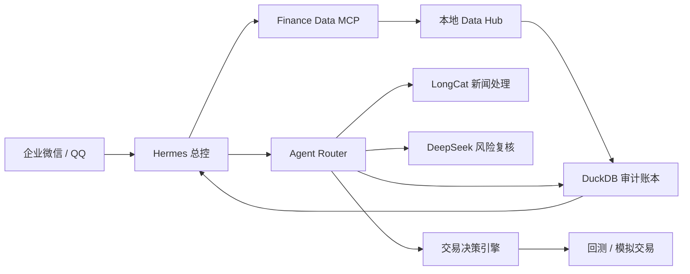

# aiquant-lite

简体中文 | [English](README.md)

`aiquant-lite` 是一个本地优先、重视证据链的 A 股投研工作区。它将结构化市场数据与
模型推理分离，避免大语言模型凭空生成价格、财务数字或公告信息。

> 当前状态：可在本机真实运行的投研、回测与模拟交易 Beta。新增交易阶段除具体券商实盘
> 适配器外已形成首个安全闭环；不连接真实资金账户，也不构成投资建议。

## 项目是否完成

研究 MVP 和本地模拟交易 v1 已完成，但生产实盘目标尚未完成：

- 已完成真实数据、六工具 MCP、Hermes/企业微信入口、模型路由、风险预算和 DuckDB 审计主链；
- 已真实跑通 LongCat 新闻处理与 DeepSeek 高风险复核；
- 已增加自动策略、技术面/基本面并行 Agent、风险否决、对抗复核、组合优化、回测、模拟盘、
  仓位与止损止盈执行，以及每日结构化复盘；
- 尚缺 30 天稳定性数据、持久化人工审批、费用统计、完整多模态角色和独立报告 Agent；
- 已有默认拒单的统一券商接口，但没有可执行的真实券商适配器，不能用于实盘自动交易。
- 已将中信证券 QMT/xtquant 记录为未来可替换适配器方向；权限未确认，当前不安装、不连接、
  不探测 QMT，paper trading 仍是唯一活动执行模式。

详细完成度、运行证据和剩余工作见[项目状态与运行逻辑](docs/project-status.zh-CN.md)。

## 通俗运行逻辑



简单说：Hermes 负责接待和调度，Data Hub 负责找事实，Router 负责找合适的模型分析，
DeepSeek 负责高风险复核，DuckDB 负责留下可追溯记录，最后由 Hermes 把结果发回手机。

新增交易引擎的完整运行逻辑、接口和边界见
[交易决策与模拟执行引擎](docs/trading-engine.zh-CN.md)。
中信证券权限确认和安全接入顺序见
[中信 QMT/xtquant 预留说明](docs/brokers/citic-qmt-readiness.zh-CN.md)。

## 架构

```text
Hermes / 其他 MCP 客户端
          |
          v
Finance Data MCP  ---->  Agent Router
          |                 |-- LongCat：新闻处理
          |                 `-- Qwen：公告核验
          v
本地 Data Hub
  |-- Tushare Pro
  |-- AKShare / 交易所公开来源
  `-- BaoStock
          |
          v
DuckDB 审计与证据存储
```

仓库目前包括：

- 股票基础信息、日线、实时行情、财务报表、公告与财经新闻的 FastAPI 数据服务；
- 跨来源日线核验和带来源标记的记录；
- 使用 LongCat、Qwen 的专业模型路由与审计流水线；
- 仅开放六个只读研究工具的 Finance Data MCP 服务；
- 基于已持久化证据的确定性市场事实核验；
- 支持备份、回滚、MCP 白名单和企业微信定时任务迁移的 Hermes 安装器；
- 可审计的风险等级与模型调用预算控制。
- 可配置的 DeepSeek、MiMo Provider，以及安全的高风险复核降级机制。

## Finance Data MCP 工具

| 工具 | 用途 |
|---|---|
| `get_realtime_quote` | 返回 A 股实时行情，或经过核验的最近收盘价回退结果 |
| `get_daily_bars` | 获取并交叉核对多个结构化来源的日线数据 |
| `get_financial_statement` | 返回指定报告期的三大财务报表 |
| `list_announcements` | 列出带来源信息的巨潮资讯公告 |
| `search_finance_news` | 搜索财经媒体报道，并保留“未经核验”状态 |
| `verify_market_fact` | 将一个事实声明与已保存、可追溯的证据进行比较 |

## 快速开始

环境要求：Python 3.11 和 [uv](https://docs.astral.sh/uv/)。

```powershell
git clone https://github.com/Shixi216/aiquant-lite.git
cd aiquant-lite
uv sync --dev
Copy-Item .env.example .env
```

只在 `.env` 中填写你实际使用的数据源或模型凭据，绝对不要提交该文件。

启动 REST 服务：

```powershell
uv run python scripts/run_data_api.py
uv run python scripts/run_router_api.py
```

通过 stdio 启动 MCP 服务，这是本地 Hermes 集成的默认推荐方式：

```powershell
uv run python -m mcp_servers.finance_data.server
```

先预览、再连接现有 Hermes 0.18 安装：

```powershell
$env:HERMES_HOME = "E:\hermes"
uv run python scripts/configure_hermes_integration.py
uv run python scripts/configure_hermes_integration.py --apply
```

备份、验证与投递说明见 [Hermes 集成文档](docs/hermes-integration.md)。Hermes 本机配置和
凭据始终保留在本仓库之外。

如需在本机启用 Streamable HTTP：

```powershell
$env:OPC_MCP_TRANSPORT = "streamable-http"
uv run python -m mcp_servers.finance_data.server
```

此时端点为 `http://127.0.0.1:8767/mcp`。在没有认证和网络访问控制的情况下，不要将其
绑定到公网接口。

## 核验策略

`verify_market_fact` 不调用大语言模型。只有至少两个相互独立的已存储来源在允许误差内
一致时，结构化事实才会被判定为已核验。对于直接来自官方公告的事实，一份经过核验的
官方公告即可作为充分证据。证据不足或来源冲突时，系统会明确返回对应状态，不会静默
选择一个结果。

## 风险与预算路由

通用 Router 请求支持以下参数：

- `risk_level`：`low`、`medium`、`high` 或 `critical`；
- `budget_tier`：`economy`、`standard` 或 `premium`。

策略完全确定，并在任何模型调用之前执行：

- 预算等级限制单次输出 Token 数和物理模型调用总次数；
- 风险等级限制采样温度；
- `high` 和 `critical` 结果会标记为需要人工复核，并在 `risk_controller` 可用后请求升级；
- 不兼容的组合会提前拒绝，例如 `critical` 风险不能使用 `standard` 预算，从而避免消耗
  Provider 配额或凭据资源。

最终决策通过 `RouterInvokeResponse.routing` 返回，并和 Agent 结果一起写入审计记录。
可通过 `GET /v1/routing/policy` 查看不含凭据的公开策略矩阵。

对于 `high` 和 `critical` 请求，如果 DeepSeek 已配置，Router 会在同一个 `task_id` 和
物理调用预算内自动执行一次 `risk_controller` 复核。结果通过 `risk_review.status` 返回：

- `completed`：已获得并校验结构化复核结果；
- `unavailable`：风险控制 Provider 尚未配置；
- `failed`：Provider 调用或结构化输出校验失败；
- `budget_exhausted`：本次请求已用完允许的物理模型调用次数。

以上所有状态都不会取消人工复核要求。自动复核是额外防线，不能替代人工审批。

## 专业模型 Provider

DeepSeek 使用官方 OpenAI 兼容端点，默认模型为 `deepseek-v4-pro`：

```dotenv
DEEPSEEK_API_KEY=
OPC_DEEPSEEK_BASE_URL=https://api.deepseek.com
OPC_DEEPSEEK_MODEL=deepseek-v4-pro
```

MiMo 已注册为 OpenAI 兼容 Provider，但必须显式配置端点，避免项目在未经确认的情况下将
私有材料发送给假定的第三方地址：

```dotenv
XIAOMI_API_KEY=
OPC_MIMO_BASE_URL=
OPC_MIMO_MODEL=mimo-v2.5
```

MiMo Provider 适配器已经可用。Router 仍需先加入可审计的图片输入协议，之后才会启用
视觉角色。

### 本地私有配置

如果 Provider 凭据已经保存在 Hermes 中，可以先预览、再执行白名单同步：

```powershell
uv run python -m scripts.sync_local_provider_env --source E:\hermes\.env
uv run python -m scripts.sync_local_provider_env --source E:\hermes\.env --apply
```

同步器只复制当前项目实际使用的数据、搜索和模型变量。QQ、企业微信、TokenHub 和其他
消息渠道凭据继续留在 Hermes 主目录。命令不会打印任何值，并会将项目旧 `.env` 备份到
被 Git 忽略的 `backups/local-env/`。

可以先进行无推理费用的模型发现，再按需执行最小真实调用：

```powershell
uv run python -m scripts.check_live_specialist_providers
uv run python -m scripts.check_live_specialist_providers --invoke  # 可能产生 API 费用
uv run python -m scripts.check_live_risk_escalation                # 写入审计任务
```

不要将真实凭据粘贴到源码、Commit、Issue、Pull Request 或诊断日志中。任何已经离开预期
密钥存储位置的凭据都应尽快轮换。

## 实盘边界

本仓库目前不会向券商发送订单，研究输出不得直接连接真实资金账户。在未来启用任何实盘
适配器之前，必须完整实现并验证 [实盘准备清单](docs/live-trading-readiness.zh-CN.md)，包括
模拟盘、订单限额、幂等、紧急停止、成交对账、人工审批和事故回滚。

## 安全与隐私

- `.env`、凭据备份、数据库、运行日志、下载的文档和缓存均被 Git 排除；
- `.env.example` 只提供变量名，不包含可用凭据；
- MCP 默认仅绑定本机，并只暴露小型只读工具白名单；
- Provider 输出一律视为不可信输入，媒体报道不会被自动升级为事实；
- 每次公开发布前都应运行测试，并扫描暂存差异中的敏感信息。

如发现安全问题，请按照 [SECURITY.md](SECURITY.md) 的说明私下报告，不要创建包含敏感
细节的公开 Issue。

## 开发

```powershell
uv run pytest
uv run ruff check .
```

贡献规范见 [CONTRIBUTING.md](CONTRIBUTING.md)。

## 路线图

- 完成自选股日报的一周验收和 30 个交易日指标；
- 为 `human_reviews` 增加人工审批 API 和操作界面；
- 增加 Provider 费用计算和可靠性指标汇总；
- 增加可审计的多模态请求协议并启用 MiMo 视觉角色；
- 将人工复核要求接入明确的审批队列；
- 在接入任何下单适配器前实现模拟盘和券商安全门槛；
- 对迁移后的定时日报进行完整交易周验证；
- 累积 30 天可靠性、延迟、成本、覆盖率和人工复核指标。

## 许可证

MIT，详见 [LICENSE](LICENSE)。
