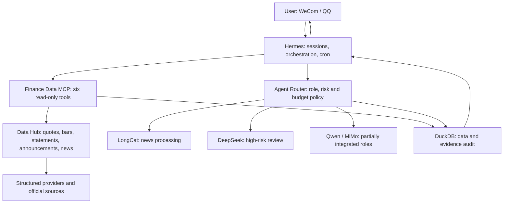

# Project status and runtime

> Status date: 2026-07-29. Current release: 0.10.0.

`aiquant-lite` is a runnable local A-share research MVP with an auditable backtesting and
paper-trading v1. It is not a completed live-trading production system.

- The real-data, real-provider, Hermes/MCP, risk-review, and audit path works locally.
- LongCat news processing and DeepSeek risk control are enabled in the generic Router.
- Qwen announcement verification exists as a dedicated pipeline but is not yet a generic role.
- MiMo connectivity works, while audited multimodal inputs and vision handlers remain unfinished.
- The migrated daily report still needs a full trading-week and 30-day reliability run.
- Human review persistence APIs, cost calculation, and experiment dashboards remain unfinished.
- Parallel technical/fundamental analysis, strategy generation, hard risk veto, adversarial
  review, bounded portfolio optimization, backtesting, paper positions, and protective exits work.
- Router 0.10.0 contains no real-broker adapter, credential model, account synchronization, or
  real-order route. Paper trading is the only execution mode.
- Non-live APIs are classified under `/v1/decisions`, `/v1/simulations`, and `/v1/reviews`;
  `/v1/trading/*` remains a deprecated one-version compatibility surface.
- Decision results use immutable, source-traceable `DecisionPacket` versions with read-time
  SHA-256 verification; adversarial challenges are append-only reviews.
- User-reported external fills can be recorded in a separate append-only manual ledger through
  expiring previews and same-user confirmation. Manual positions are read-time projections and
  remain isolated from Paper Trading.
- Manual-position risk reviews append evidence-traceable advisory audits without changing the
  manual ledger, position projection, or simulation account. Unified daily reviews read all four
  domains through capability-limited read-only repositories.
- Stage 6 reorganized internal modules into research, decision-support, simulation, review, and
  manual-tracking packages without changing HTTP or database contracts.

## Runtime flow

Hermes is the control plane. It uses the Finance Data MCP for facts and the Agent Router for
specialist reasoning. The Data Hub fetches and attributes source data. High-risk model output is
reviewed by DeepSeek when available, but still requires human review. DuckDB records data,
evidence, model usage, latency, and agent results.

See the more detailed [Chinese status report](project-status.zh-CN.md), the
[stage-1 safety migration](migrations/0.9.0-remove-live-execution.zh-CN.md), and the
[stage-3 DecisionPacket migration](migrations/0.9.0-immutable-decision-packets.md). The
[stage-4 note](migrations/0.9.0-manual-trade-ledger.md) documents the manual fact ledger, and the
[stage-5 note](migrations/0.9.0-manual-position-risk-review.zh-CN.md) documents advisory position
risk reviews and the unified read-only daily review. The
[stage-6 note](migrations/0.9.0-internal-package-layout.zh-CN.md) records the internal package
migration.
