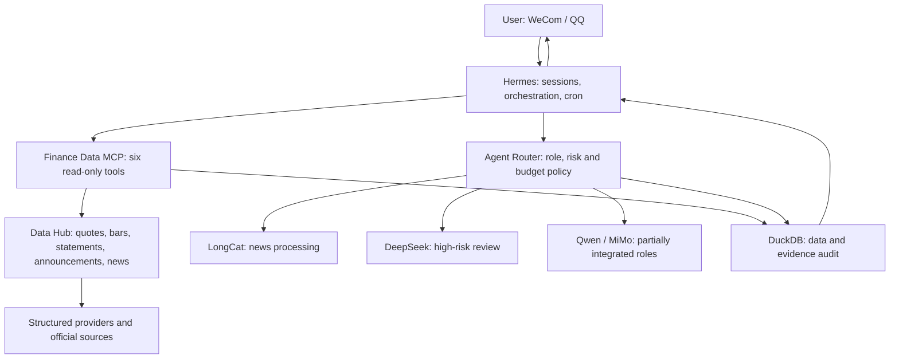

# Project status and runtime

> Status date: 2026-07-21

`aiquant-lite` is a runnable local A-share research MVP, not a completed production system. The
original project plan is approximately **75% complete**.

- The real-data, real-provider, Hermes/MCP, risk-review, and audit path works locally.
- LongCat news processing and DeepSeek risk control are enabled in the generic Router.
- Qwen announcement verification exists as a dedicated pipeline but is not yet a generic role.
- MiMo connectivity works, while audited multimodal inputs and vision handlers remain unfinished.
- The migrated daily report still needs a full trading-week and 30-day reliability run.
- Human review persistence APIs, cost calculation, and experiment dashboards remain unfinished.
- No broker or live-order execution capability exists.

## Runtime flow

Hermes is the control plane. It uses the Finance Data MCP for facts and the Agent Router for
specialist reasoning. The Data Hub fetches and attributes source data. High-risk model output is
reviewed by DeepSeek when available, but still requires human review. DuckDB records data,
evidence, model usage, latency, and agent results.

See the more detailed [Chinese status report](project-status.zh-CN.md) and the
[live-trading readiness gates](live-trading-readiness.md).
