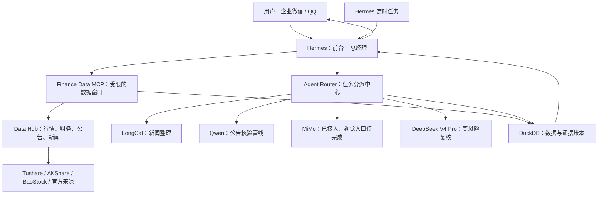

# 项目状态与运行逻辑

> 状态日期：2026-07-29。当前版本：0.10.0。

## 一句话结论

`aiquant-lite` 已经完成一个**可在本机真实运行的 A 股投研 MVP**，并增加了可审计的回测和
模拟交易 v1。Router 0.10.0 不包含真实资金自动交易能力。

- 作为“能取真实数据、能调用真实模型、能通过 Hermes 使用、能留下审计记录”的投研原型：
  **已经完成**。
- 作为“经过连续 30 天验证、具备完整人工审批与成本指标的生产级投研系统”：**尚未完成**。
- 作为“可回测、可模拟成交、可管理仓位并执行模拟止损止盈的系统”：**v1 已完成**。
- 作为“可以连接真实资金账户并自动下单的交易系统”：**不支持，相关生产代码已彻底删除**。

完成度是对最初目标的工程估算，不是质量评分，也不代表投资可靠性。

## 当前完成度

| 模块 | 估算完成度 | 当前状态 |
|---|---:|---|
| 本地数据层 | 85% | Tushare、AKShare、BaoStock、公告和新闻服务已经接入；仍需长期观察接口稳定性 |
| Finance Data MCP | 100% | Hermes 已连接，严格开放六个只读工具 |
| 多模型 Router | 65% | LongCat 新闻处理和 DeepSeek 风控已真实运行；其余角色尚未全部启用 |
| 风险与预算控制 | 80% | 风险等级、调用预算、高风险自动复核已完成；人工审批队列未完成 |
| DuckDB 审计 | 70% | 数据、证据、Token、耗时和 Agent 结果可记录；费用计算与人工复核写入接口未完成 |
| Hermes / 企业微信 | 85% | Gateway、企业微信、QQ、MCP 和定时任务已配置；迁移后的日报还需连续验证 |
| 30 天实验与指标 | 10% | 尚未积累完整交易月数据，也没有正式对比报告 |
| 交易决策与多 Agent | 80% | 技术面/基本面并行、策略生成、硬风控否决和对抗复核已完成 v1 |
| 回测与组合优化 | 65% | 无前视回测、成本、滑点、回撤、夏普和受限权重已完成；市场微结构待补 |
| 模拟交易与仓位 | 75% | 现金、持仓、审批、幂等、紧急停止和模拟止损止盈已完成；需 30 日验收 |
| 人工成交事实账本 | 已完成 v1 | 两阶段确认、追加式修正、动态持仓投影和模拟账户隔离已完成 |
| 人工持仓风险复核 | 已完成 v1 | 真实研究数据刷新、确定性规则、可选高风险模型复核和追加审计已完成 |
| 统一每日复盘 | 已完成 v1 | 只读比较决策、模拟结果、人工成交、当前持仓、风险规则和证据缺口 |
| 内部包结构 | 已完成 0.9.0 整理 | research、decision_support、simulation、review 与 manual_tracking 已分层 |
| 真实资金自动交易 | 不支持 | 0.9.0 已删除适配器、凭据配置、账户同步和真实订单接口 |

决策结果已升级为不可变的 `DecisionPacket` 版本链：每个版本保存来源记录、模型调用、证据与推断
的明确分层，并使用 SHA-256 校验完整性。`FINAL` 内容不能覆盖；新数据、重新分析或明确形成新
结论的挑战只能追加版本。普通挑战只追加对抗审查记录，不会修改历史决策。

人工成交账本只记录用户已经在外部客户端完成的事实。自然语言或 HTTP 输入先产生 preview，
只有同一用户在有效期内明确确认才会追加 `manual_trades`。人工持仓由成交与修正记录动态投影，
没有可直接写入的持仓表；它和 Paper Trading 账户互不读写。

人工持仓风险复核读取动态持仓、关联的不可变决策包和最新可追溯研究数据，先执行确定性规则，
必要时再调用高风险模型。它只追加风险审计记录，建议枚举不包含可执行动作，也不会修改成交、
持仓或模拟账户。每日复盘服务只持有决策、模拟、人工成交和风险复核的只读 Repository 视图，
用于识别计划偏离、模型问题、证据缺失和数据质量问题。

阶段 6 只整理内部 Python 包路径，没有修改 HTTP API、响应模型或 DuckDB Schema。旧根模块已被
移动而不是复制，所有生产代码、测试和脚本均使用新路径；目标结构由自动化测试和无实盘检查共同
守卫。

## 把系统想成一家小型研究公司

可以用以下比喻理解各部分：

- **企业微信 / QQ 是前台窗口**：你从手机提出问题并接收结果。
- **Hermes 是总经理**：负责会话、拆任务、调用工具、定时执行和最终回复。
- **Finance Data MCP 是有白名单的数据窗口**：Hermes 只能调用六个批准过的只读研究工具。
- **Data Hub 是资料仓库**：直接向结构化数据源和官方来源取数，不让大模型编造价格。
- **Agent Router 是任务分派中心**：根据角色、风险等级和预算选择模型及调用限制。
- **LongCat、Qwen、MiMo、DeepSeek 是专业人员**：分别处理新闻、公告、视觉和风险复核。
- **DuckDB 是审计账本**：保存数据来源、模型调用、Token、耗时、结果和证据链。

## 一次普通查询怎样运行

以“查询某只股票最近公告并判断风险”为例：

1. 用户从企业微信把问题发给 Hermes。
2. Hermes 判断需要先取事实，而不是直接让模型回答。
3. Hermes 通过 `finance_data` MCP 调用 `list_announcements` 等工具。
4. Data Hub 从公告或数据来源获取记录，保存来源、URL、时间和校验状态。
5. 如需文本分析，Hermes 或内部管线把证据交给 Agent Router。
6. Router 根据角色、`risk_level` 和 `budget_tier` 限制模型、温度、Token 和物理调用次数。
7. 普通新闻由 LongCat 整理；高风险结果再交给 DeepSeek `risk_controller` 复核。
8. 自动风控成功也不会取消人工复核要求。
9. 数据、模型调用和结果写入 DuckDB，Hermes 再把摘要返回企业微信。

关键原则是：**模型负责理解和归纳，结构化数据服务负责事实。**

Tavily 的凭据和独立连通性已经验证，但它当前不是 Data Hub 的结构化行情来源，也不参与
自选股日报的价格与 K 线查询；新闻工具目前主要通过 AKShare 获取东方财富个股新闻。

## 自选股日报怎样运行

1. Hermes 在交易日 15:30 触发“自选股收盘日报”。
2. 任务只启用 `finance_data` 工具集，不再使用 Tavily 搜索价格和 K 线。
3. 每只股票通过本地 MCP 获取行情、公告和新闻；重要数字调用事实核验。
4. 证据不足或来源冲突时必须标记“未验证”，不能猜测。
5. 报告完成后投递到企业微信 Home Channel。

任务已经配置并启用，但状态日期时迁移后的新任务尚未完成一个交易周验证；历史
`last_status` 仍保留旧错误。因此它属于“配置完成、运行稳定性待验证”，不能算完全验收。

## 当前真正可用的模型角色

| 角色 | Provider | 状态 | 说明 |
|---|---|---|---|
| `news_processor` | LongCat 2.0 | 已启用 | 真实调用成功，可做新闻结构化、聚类和摘要 |
| `risk_controller` | DeepSeek V4 Pro | 已启用 | 真实调用成功，可在高风险任务中自动复核 |
| `announcement_verifier` | Qwen 3.7 Plus | 部分完成 | 专用公告核验管线存在，通用 Router 角色尚未启用 |
| `vision_reader` | MiMo V2.5 | Provider 已就绪 | 真实文本连通成功，但 Router 尚无可审计图片输入协议 |
| `complex_vision` | MiMo V2.5 Pro | 未启用 | 等待多模态协议和连续工具调用验证 |
| `adversarial_reviewer` | Hy3 | 未实现 | 只有角色定义，没有 Provider 和 Handler |

Hermes 当前默认总控模型为 DeepSeek V4 Flash。报告生成仍由 Hermes 总控流程承担，尚未
拆成独立的 `report_agent` 服务。

## 已经验证过什么

- Router `0.7.0` 和 Data Hub 健康检查通过。
- Hermes Finance Data MCP 发现并连接六个工具。
- DeepSeek V4 Pro、Qwen 3.7 Plus、MiMo V2.5、LongCat 2.0 和 Tavily 真实调用成功。
- LongCat 主处理到 DeepSeek 高风险复核的端到端任务完成。
- 该任务记录了两次物理模型调用、两条 Agent 结果和完成状态。
- 当前自动化测试 32 项通过，Ruff 通过。
- 企业微信与 QQ Gateway 均已连接。

## 还差什么才算完成原始目标

优先级从高到低：

1. **连续运行验收**：让自选股日报至少稳定运行一个完整交易周，再积累 30 个交易日指标。
2. **人工复核闭环**：为已有 `human_reviews` 表增加写入 API、身份记录、审批状态和查询界面。
3. **费用与质量指标**：根据 Provider 价格计算真实费用，并汇总失败率、耗时、覆盖率和漏检率。
4. **公告通用角色**：把现有 Qwen 公告核验管线正式接到通用 Router 角色入口。
5. **多模态协议**：增加受限图片输入、文件哈希、来源记录和 MiMo 视觉 Handler。
6. **报告角色**：把报告生成从 Hermes 提示流程拆为可测试、可审计的独立角色。
7. **容灾验证**：验证模型 429、超时、认证失败和数据源故障时的回退行为。

## 真实资金边界

当前系统没有连接真实资金账户或发送真实订单的接口，也不接受相关凭据。0.9.0 的历史变更见
[安全迁移说明](migrations/0.9.0-remove-live-execution.zh-CN.md)。当前正确的产品定位是：

> **可真实运行、可审计的 A 股投研与模拟分析工作台，不是自动交易系统。**
