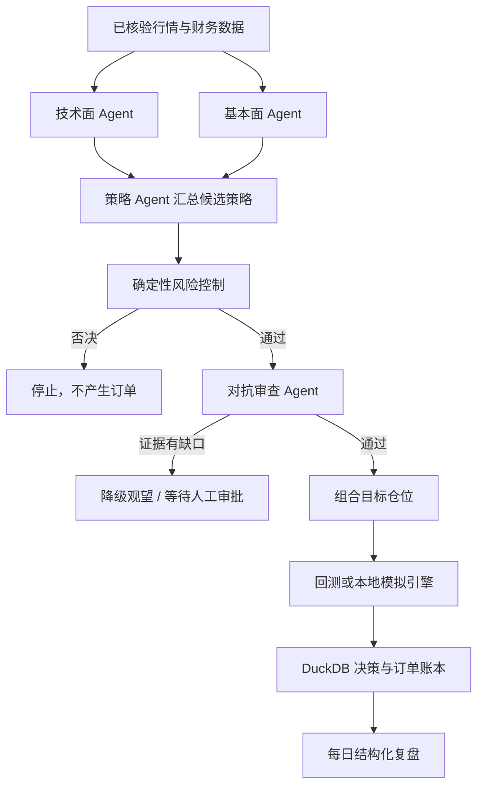

# 交易决策与模拟执行引擎

> 状态日期：2026-07-29。当前 Router 版本：0.10.0。该模块可用于研究、回测和本地模拟盘，
> 不能连接真实资金账户。

## 当前完成情况

| 能力 | 状态 | 说明 |
|---|---|---|
| 自动生成交易策略 | 已完成 v1 | 技术面 60% + 基本面 40% 的透明规则，输出入场、退出和失效条件 |
| 多 Agent 并行讨论 | 已完成 v1 | 技术面与基本面 Agent 并行运行，策略 Agent 汇总为结构化观点 |
| 风险控制 Agent 否决 | 已完成 v1 | 紧急停止、日亏、总敞口、现金底线和单票仓位规则拥有硬否决权 |
| 对抗审查 Agent 复核 | 已完成 v1 | 检查证据缺口、基本面缺失和 Agent 置信度冲突；买入有缺口时降级为观望 |
| 技术面 Agent | 已完成 v1 | SMA20/60、EMA12/26、RSI14、成交量和风险提示 |
| 基本面 Agent | 已完成 v1 | ROE、收入增长、负债率、经营现金流及证据引用 |
| 组合优化 | 已完成 v1 | 正向得分/波动率加权，限制单票仓位、总敞口并保留现金 |
| 回测引擎 | 已完成 MVP | 前一收盘生成信号、下一开盘成交，含佣金、滑点、止损止盈、夏普和最大回撤 |
| 模拟交易 | 已完成 v1 | 现金、持仓、成本、收益、A 股买入手数、审批、幂等、拒单、重启恢复和紧急停止 |
| 仓位管理 | 已完成 v1 | 目标权重限制、持仓均价、可用现金、总资产和已实现收益 |
| 止损止盈执行 | 模拟盘已完成 | 默认 7% 止损、15% 止盈，可配置；保护性卖出由确定性规则执行 |
| 真实资金自动交易 | 不支持 | 0.9.0 已删除适配器、凭据配置、账户同步和真实订单接口 |
| 人工持仓风险复核 | 已完成 v1 | 读取动态持仓、关联决策与最新研究证据，追加规则/模型复核审计 |
| 每日复盘 | 已完成 v1 | JSON 和中文 Markdown 统一比较决策、模拟结果、人工成交、持仓与风险复核 |

## 一次决策怎样运行



关键原则：Agent 只能提出候选结论，不能绕过确定性风控；风险控制拥有最终否决权；对抗审查
不能把证据不足的买入意见直接交给执行层；模拟订单默认需要记录人工审批身份。

## 内部包结构

阶段 6 以后，业务代码按职责分层：

```text
trading/
├─ research/
│  ├─ technical/
│  ├─ fundamental/
│  ├─ sentiment/
│  └─ events/
├─ decision_support/
│  ├─ orchestrator/
│  ├─ risk_rules/
│  ├─ adversarial_review/
│  └─ decision_packets/
├─ simulation/
│  ├─ backtest/
│  ├─ paper_account/
│  ├─ portfolio/
│  └─ hypothetical_orders/
└─ review/
   ├─ daily/
   ├─ attribution/
   └─ rule_evaluation/

manual_tracking/
├─ trades/
├─ positions/
├─ confirmations/
└─ risk_reviews/
```

`trading/routes.py` 和 `trading/schemas.py` 继续作为稳定的 HTTP 装配层和共享响应契约。目录整理
不保留重复业务实现，也没有改变任何 API 或数据库表。

## 本地运行

启动 Router 后访问 `http://127.0.0.1:8765/docs`，可以直接试用以下接口：

| 接口 | 用途 |
|---|---|
| `POST /v1/decisions/from-data` | 从 Data Hub 取日线，再生成并保存决策 |
| `GET /v1/decisions/{decision_id}` | 读取并校验最新决策版本 |
| `GET /v1/decisions/{decision_id}/versions` | 列出决策的全部历史版本 |
| `GET /v1/decisions/{decision_id}/versions/{version}` | 读取并校验指定版本 |
| `POST /v1/decisions/{decision_id}/challenge` | 追加对抗审查；仅在显式请求时形成新版本 |
| `POST /v1/manual-trades/previews` | 创建人工成交预览，不直接入账 |
| `GET /v1/manual-trades/previews/{confirmation_id}` | 查询预览状态和标准化内容 |
| `POST /v1/manual-trades/previews/{confirmation_id}/confirm` | 由创建人明确确认并追加成交 |
| `POST /v1/manual-trades/previews/{confirmation_id}/cancel` | 由创建人取消待确认预览 |
| `GET /v1/manual-trades` | 查询全部原始、修正和冲销记录 |
| `GET /v1/manual-trades/{trade_id}` | 查询一条人工成交事实 |
| `POST /v1/manual-trades/{trade_id}/corrections` | 创建修正或冲销 preview，仍需确认 |
| `GET /v1/manual-positions` | 动态聚合人工持仓 |
| `GET /v1/manual-positions/{position_id}` | 查询一个动态人工持仓投影 |
| `POST /v1/manual-positions/{position_id}/risk-reviews` | 刷新研究数据并追加一次只读风险复核 |
| `GET /v1/manual-positions/{position_id}/risk-reviews` | 查询该持仓的全部追加式风险复核 |
| `GET /v1/manual-positions/{position_id}/risk-reviews/latest` | 查询最新一次风险复核 |
| `POST /v1/simulations/backtests` | 执行无前视的单标的回测 |
| `POST /v1/simulations/portfolio/optimize` | 生成受限组合权重 |
| `POST /v1/simulations/paper-orders` | 提交模拟订单 |
| `GET /v1/simulations/paper-account` | 查看模拟现金、持仓和权益 |
| `POST /v1/simulations/protective-exits` | 检查并执行模拟止损止盈 |
| `POST /v1/simulations/kill-switch` | 开关模拟盘紧急停止 |
| `POST /v1/reviews/daily` | 按请求体中的 `date` 生成结构化复盘 |
| `GET /v1/reviews/daily/{date}` | 返回每日结构化 JSON 复盘 |
| `GET /v1/reviews/daily/{date}/markdown` | 返回可读的中文 Markdown 复盘 |

旧 `/v1/trading/*` 非实盘接口保留一版兼容别名，响应包含 `Deprecation: true` 和 `Sunset`
响应头，并在 OpenAPI 中标记为弃用。新旧接口调用同一组 Service，响应模型保持一致。

## 不可变 DecisionPacket

决策包使用 `(decision_id, decision_version)` 作为联合主键。版本状态只允许 `DRAFT`、
`FINAL` 和 `SUPERSEDED`。`FINAL` 后不得修改事实、证据、模型推断、风险结论或数据截止时间；
重新分析必须追加一个填写 `supersedes_version` 的新版本，旧版本只能在 payload 不变的前提下
标记为 `SUPERSEDED`。

每个版本对除 `packet_hash` 自身之外的规范化 JSON 计算 SHA-256。Repository 在每次读取时重新
计算哈希，并交叉核对证据、Agent 观点、风险否决和初始对抗审查快照。发现篡改时接口返回完整性
错误，同时向 `decision_integrity_audit` 写入审计记录。`verified_facts` 只能保存可追溯事实，
`model_inferences` 只能保存模型推断，二者不能混用。

## 人工成交账本

人工成交不是系统订单，而是用户已经在外部券商客户端完成的事实记录。Router 不登录券商、不
读取券商账户，也不会自动判断该成交是否真实。`source` 只允许 `USER_REPORTED` 或
`USER_IMPORTED`，`verification_status` 固定为 `USER_REPORTED`。

所有新增和修正都经过两阶段确认：先返回标准化内容、哈希和 `confirmation_id`，再由同一已认证
用户在有效期内明确确认。重复确认同一 `confirmation_id` 会幂等返回原结果；相同组合内重复的
`client_trade_id` 不会重复入账。聊天入口只接受精确格式
`确认录入 <confirmation_id>`。

`manual_trades` 从不更新或删除。录错时创建 `CORRECTION` 或 `REVERSAL` preview，确认后追加
修正成交和修正元数据，原成交仍可查询。`manual_positions` 不是表，也没有写入接口；Repository
每次读取时根据全部原始和修正记录动态投影。该投影与 Paper Trading 的现金、订单和持仓完全隔离。

## 人工持仓风险复核

复核先读取人工持仓投影及其成交历史中最新关联的 `DecisionPacket`，再刷新实时行情、官方公告、
财经新闻和财务报表。数据服务返回后，复核会重新查询 DuckDB，只把确实已持久化的记录 ID 写进
`evidence_record_ids`。新闻继续保留“媒体、未核验”属性，不能与已验证事实混用。

确定性规则检查报价缺失或过期、价格相对人工平均成本的跌幅、空头投影、重大公告关键词和研究
数据缺口。只有达到 `HIGH` 或 `CRITICAL` 且请求允许时，才调用 `risk_controller` 做补充复核。
模型输出被压缩为结构化推断和调用 ID，不会保存或展示隐藏思维链。

`recommended_action` 只允许：

- `CONTINUE_OBSERVATION`
- `HUMAN_REVIEW_REQUIRED`
- `CONSIDER_REDUCING`
- `CONSIDER_EXITING`

这些值都是供用户判断的建议。风险服务只能向 `manual_position_risk_reviews` 追加审计记录，
没有写人工成交、人工持仓或模拟账户的能力。

统一每日复盘的 `ReviewService` 只接收四个能力受限的只读 Repository：决策、模拟审计、人工成交
投影和风险复核。它比较当时决策、同日模拟结果、用户报告的人工成交、当前人工持仓、规则触发、
计划偏离、模型问题、证据缺失和数据质量问题，但不能创建或确认任何成交。

也可以从命令行生成当天复盘：

```powershell
uv run python -m scripts.generate_daily_review --date 2026-07-22
```

保护性退出不是后台常驻行情订阅器；需要由 Hermes 定时任务或其他受控调度器用最新报价周期性
调用。模拟账户快照保存在 DuckDB，Router 重启后会恢复现金、持仓和紧急停止状态。

## 关于“思维链”

系统不会请求、保存或公开模型的隐藏思维链。这类内部推理既不是可靠的审计证据，也可能包含
不应长期保存的信息。每日复盘提供可用于工程审计的替代物：

- 使用了哪些行情、财务数据和证据引用；
- 技术面、基本面和策略 Agent 各自的立场、置信度、摘要与反例；
- 风控规则为什么放行、限仓或否决；
- 对抗审查发现了什么、要求补什么；
- 最终动作、目标仓位、模拟订单、成交价、费用和拒绝原因。

这叫“决策轨迹”，能清晰复盘且不会伪装成模型逐字内心独白。

## 回测边界

当前回测引擎已经防止使用当天收盘信号在当天开盘成交，但仍是 MVP。它尚未模拟复权、分红、
停牌、涨跌停、流动性冲击、卖出印花税、融券、集合竞价和逐笔成交。因此回测结果只能用于代码
验证和策略筛选，不能当作未来收益承诺。

## 真实资金边界

Router 0.10.0 不包含真实资金账户连接、登录、同步或订单发送能力，也不接受相关凭据。研究决策
不会自动进入外部执行系统；唯一可执行路径是本地 Paper Trading。旧版安全占位器的删除记录见
[0.9.0 安全迁移说明](migrations/0.9.0-remove-live-execution.zh-CN.md)。
