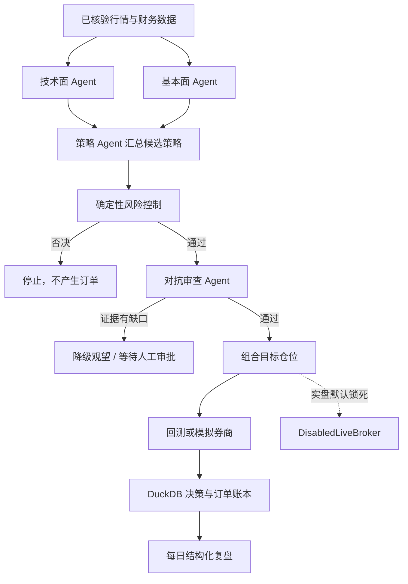

# 交易决策与模拟执行引擎

> 状态日期：2026-07-22。该模块可用于研究、回测和本地模拟盘，不能连接真实资金账户。

## 当前完成情况

| 能力 | 状态 | 说明 |
|---|---|---|
| 自动生成交易策略 | 已完成 v1 | 技术面 60% + 基本面 40% 的透明规则，输出入场、退出和失效条件 |
| 多 Agent 并行讨论 | 已完成 v1 | 技术面与基本面 Agent 并行运行，策略 Agent 汇总为结构化观点 |
| 风险控制 Agent 否决 | 已完成 v1 | 紧急停止、日亏、总敞口、现金底线和单票仓位规则拥有硬否决权 |
| 对抗审查 Agent 复核 | 已完成 v1 | 检查证据缺口、基本面缺失和 Agent 置信度冲突；买入有缺口时降级为观望 |
| 技术面 Agent | 已完成 v1 | SMA20/60、EMA12/26、RSI14、成交量和风险提示 |
| 基本面 Agent | 已完成 v1 | ROE、收入增长、负债率、经营现金流及证据引用 |
| 组合优化 | 已完成 v1 | 正向得分/波动率加权，限制单票仓位、总敞口并保留现金 |
| 回测引擎 | 已完成 MVP | 前一收盘生成信号、下一开盘成交，含佣金、滑点、止损止盈、夏普和最大回撤 |
| 模拟交易 | 已完成 v1 | 现金、持仓、成本、收益、A 股买入手数、审批、幂等、拒单、重启恢复和紧急停止 |
| 仓位管理 | 已完成 v1 | 目标权重限制、持仓均价、可用现金、总资产和已实现收益 |
| 止损止盈执行 | 模拟盘已完成 | 默认 7% 止损、15% 止盈，可配置；保护性卖出由确定性规则执行 |
| 真实券商下单 | 安全接口完成，实盘未启用 | `BrokerAdapter` 已定义，`DisabledLiveBroker` 永久拒单；尚未选择并认证具体券商 |
| 每日复盘 | 已完成 v1 | JSON 和中文 Markdown 展示证据、结构化观点、否决、复核与模拟成交 |

## 一次决策怎样运行



关键原则：Agent 只能提出候选结论，不能绕过确定性风控；风险控制拥有最终否决权；对抗审查
不能把证据不足的买入意见直接交给执行层；模拟订单默认需要记录人工审批身份。

## 本地运行

启动 Router 后访问 `http://127.0.0.1:8765/docs`，可以直接试用以下接口：

| 接口 | 用途 |
|---|---|
| `POST /v1/trading/decisions` | 并行分析并保存一条决策轨迹 |
| `POST /v1/trading/decisions/from-data` | 自动从 Data Hub 取日线，再生成并保存决策 |
| `POST /v1/trading/backtests` | 执行无前视的单标的回测 |
| `POST /v1/trading/portfolio/optimize` | 生成受限组合权重 |
| `POST /v1/trading/paper/orders` | 提交模拟订单 |
| `POST /v1/trading/paper/protective-exits` | 检查并执行模拟止损止盈 |
| `GET /v1/trading/paper/account` | 查看模拟现金、持仓和权益 |
| `POST /v1/trading/paper/kill-switch` | 开关模拟盘紧急停止 |
| `GET /v1/trading/reviews/daily/{日期}` | 返回每日结构化 JSON 复盘 |
| `GET /v1/trading/reviews/daily/{日期}/markdown` | 返回可读的中文 Markdown 复盘 |
| `POST /v1/trading/live/orders` | 始终返回 423，证明实盘锁仍生效 |

也可以从命令行生成当天复盘：

```powershell
uv run python -m scripts.generate_daily_review --date 2026-07-22
```

保护性退出不是后台常驻行情订阅器；需要由 Hermes 定时任务或其他受控调度器用最新报价周期性
调用。模拟账户快照保存在 DuckDB，Router 重启后会恢复现金、持仓和紧急停止状态。

## 关于“思维链”

系统不会请求、保存或公开模型的隐藏思维链。这类内部推理既不是可靠的审计证据，也可能包含
不应长期保存的信息。每日复盘提供可用于工程审计的替代物：

- 使用了哪些行情、财务数据和证据引用；
- 技术面、基本面和策略 Agent 各自的立场、置信度、摘要与反例；
- 风控规则为什么放行、限仓或否决；
- 对抗审查发现了什么、要求补什么；
- 最终动作、目标仓位、模拟订单、成交价、费用和拒绝原因。

这叫“决策轨迹”，能清晰复盘且不会伪装成模型逐字内心独白。

## 回测边界

当前回测引擎已经防止使用当天收盘信号在当天开盘成交，但仍是 MVP。它尚未模拟复权、分红、
停牌、涨跌停、流动性冲击、卖出印花税、融券、集合竞价和逐笔成交。因此回测结果只能用于代码
验证和策略筛选，不能当作未来收益承诺。

## 接通真实券商还缺什么

仓库已经提供统一券商接口和默认拒单实现，但实际接入必须先知道：券商名称、官方 API、账户市场、
是否提供模拟环境、委托类型以及授权范围。之后仍要逐项完成沙箱验收、成交/撤单/查询、断线恢复、
券商对账、价格笼子、交易时段、双人审批、最小权限密钥和紧急停止演练。

在这些信息和验收证据齐全前，环境变量 `OPC_LIVE_TRADING_ENABLED=false` 必须保持不变，当前
`/v1/trading/live/orders` 也不会读取它来放行订单；这是有意设计的双重锁。
